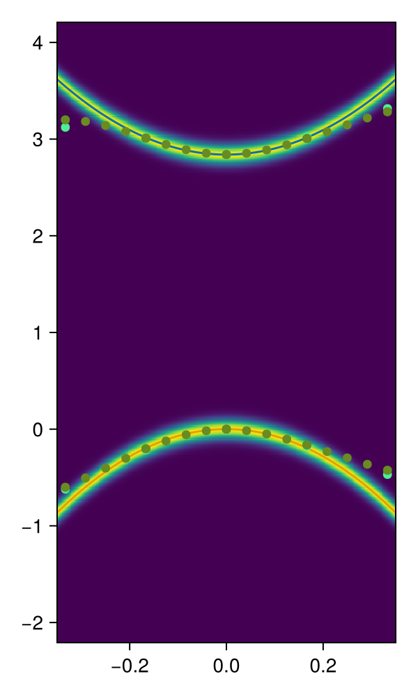

# Definition of broadening

See [`broadening-display.jl`](broadening-display.jl) to make sure the line shape of the broadening function is right,
and to see what's the correct broadening parameter to use.

# Normalization of dispersion relation

In [`units.jl`](units.jl), we define the `inv_eV` constant to
make sure we can write $E = k^2/2m$ with the unit of $k$ being inverse angstrom
and the unit of $E$ being eV.

To make sure this is done correctly, we perform a $GW$ calculation on monolayer MoS2 using BerkeleyGW
and overlay the resulting band structure along the K-K' path to the effective mass plot.
This is done in [`broadened-bands.jl`](broadened-bands.jl).
We note that the effective masses used are 
```Julia
m_h = 0.54,
m_e = 0.60,
```
which are taken from [PRB 86,115409 (2012)](https://journals.aps.org/prb/pdf/10.1103/PhysRevB.86.115409).
In [PRL 111,216805 (2013)](https://journals.aps.org/prl/pdf/10.1103/PhysRevLett.111.216805),
it is noted that these effective masses are not accurate,
and reliable predictions of the effective masses need
1. A large number of empty bands, and 
2. a large cutoff energy, and 
3. $G_1 W_0$ self-consistency.

In the benchmark in [`broadened-bands.jl`](broadened-bands.jl),
however, the first-principles calculation we use is indeed a not fully converged $G_0 W_0$ calculation,
which seems to be consistent with the conditions in [PRB 86,115409 (2012)](https://journals.aps.org/prb/pdf/10.1103/PhysRevB.86.115409).

One possible issue is that our calculation is more converged in the sense that
in our calculation, the k-grid used is 24 24 1 and the number of empty bands is 3000 
(actually it's 6000, but our calculation considers SOC,
while [PRL 111,216805 (2013)](https://journals.aps.org/prl/pdf/10.1103/PhysRevLett.111.216805) doesn't,
so essentially the number of bands the latter uses is twice as many as the number of bands in our calculation).
So possibly, a difference between the curvatures in [PRB 86,115409 (2012)](https://journals.aps.org/prb/pdf/10.1103/PhysRevB.86.115409) and in our calculation is still there,
and if the bands calculated according to the effective masses in the former 
and the bands calculated in the latter are identical,
then actually we are *wrong* in how we treat the two-band model.
We do note that the usual problem of underconvergence is the size of the band gap;
on the other hand, the structure of the wave functions at the valleys can change drastically when we change the momentum,
so it's conceivable that self-consistency mode is more important in determining the effective mass,
which then means we shouldn't worry too much about convergence.

Going back to the benchmark, by running [`broadened-bands.jl`](broadened-bands.jl) 
we get the follows


which looks reasonable.
To verify whether the number of bands influences the effective mass,
we do a further benchmark in [`broadened-bands-convergence-comparison.jl`](broadened-bands-convergence-comparison.jl),
the output of which is shown below:


This plot contains three $GW$ calculations: one with 96 bands, one with 4000 bands, and one with 4000 bands and then interpolated to a finer grid.
The last corresponds to the scatter plot in [the last figure](effective-mass-benchmark.png).
The band gaps have been shifted for spontaneous comparison of both the conduction band and the valence band.
We can see that they clearly deviate when $\vb{k}$ is away from the valley and the peak,
but they are almost identical at the valley.

Therefore the way `inv_eV` is defined seems right,
and we find that the effective mass is strongly influenced by the self-consistent mode.
Indeed this is mentioned in [PRL 111,216805 (2013)](https://journals.aps.org/prl/pdf/10.1103/PhysRevLett.111.216805):
> These SO and bandgap values at K are
> in good agreement with a previous QSGW[13] and G0W0
> [14] calculations. However, we find different values for
> the effective mass of the charge carriers at K.

In the rest of the project, parameters from the $G_1 W_0$ band structure in [PRL 111,216805 (2013)](https://journals.aps.org/prl/pdf/10.1103/PhysRevLett.111.216805) are going to be used.

# Numerical accelerations

See [`wfn-test.jl`](wfn-test.jl) to see how calculation of the 1s wave function is accelerated by `@fastmath`, which may cause numerical instability.

# Comparison with old codes

The output plot of [`ehh-k1-contribution-benchmark.jl`](ehh-k1-contribution-benchmark.jl) 
is to be compared with the output of [the old `trion-arpes-heatmap-optimized-e1h1h2-double-radii-makie-decomposed.jl`](../src/trion-arpes-heatmap-optimized-e1h1h2-double-radii-makie-decomposed.jl),
which is not written in a quite well structured way.
The results should be consistent with each other.
We note that the leftmost panel in the outputs is *not* truly $A(\vb{k}_{\text{e}}, \omega)$,
because only a subset of possible $\vb{k}_1$ - that is, $\vb{k}_1$ whose $y$ coordinate vanishes - are summed over.
The last panel in the output of [`ehh-k1-contribution-benchmark.jl`](ehh-k1-contribution-benchmark.jl) is also consistent with the ARPES plot with all $\vb{k}_1$ points (and not just those with zero $k_y$) in the output of [the old `trion-arpes-heatmap-optimized-e1h1h2-double-radii-makie-decomposed.jl`](../src/trion-arpes-heatmap-optimized-e1h1h2-double-radii-makie-decomposed.jl).

Similarly, the output of [`eeh-heatmap-prototype.jl`](eeh-heatmap-prototype.jl) seems consistent with the rightmost panel of the output of the first graphic block in [`trion-arpes-heatmap-optimized-e1e2h1-double-radii-makie-decomposed.jl`](../src/trion-arpes-heatmap-optimized-e1e2h1-double-radii-makie-decomposed.jl).

# Correctness of dispersion relations

See [`ehh-analytic.jl`](ehh-analytic.jl).