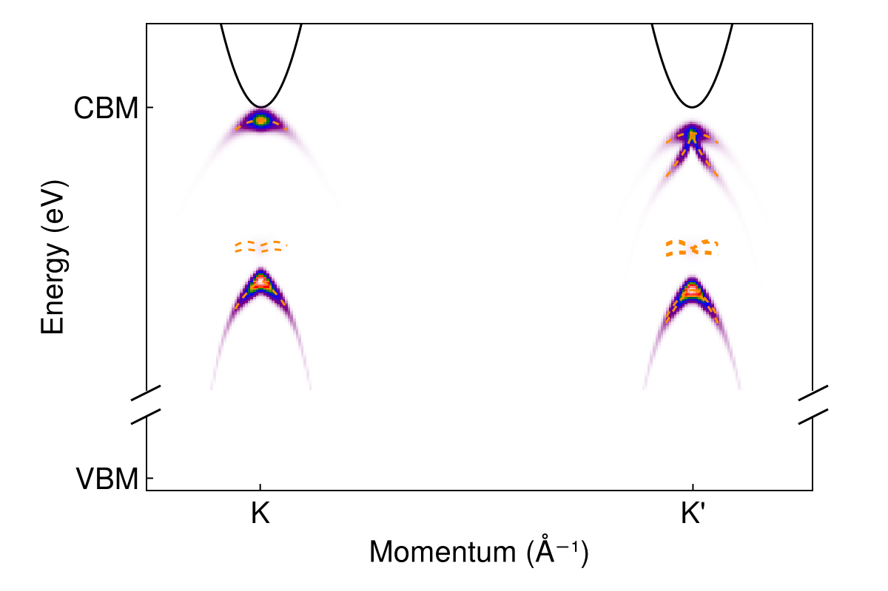
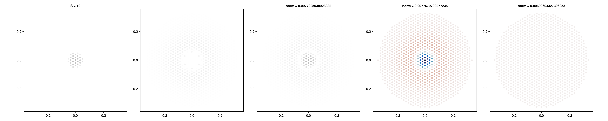
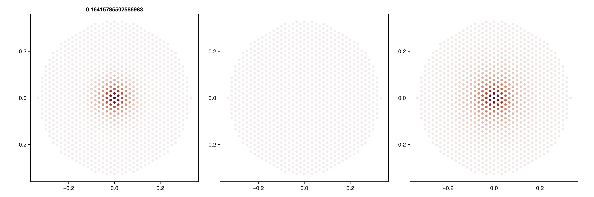
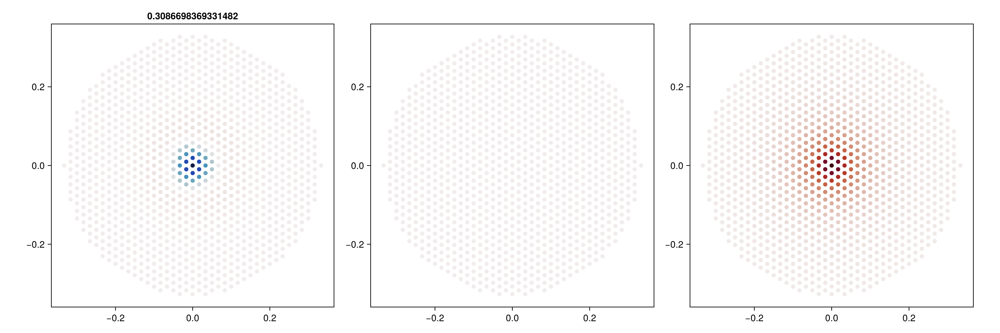
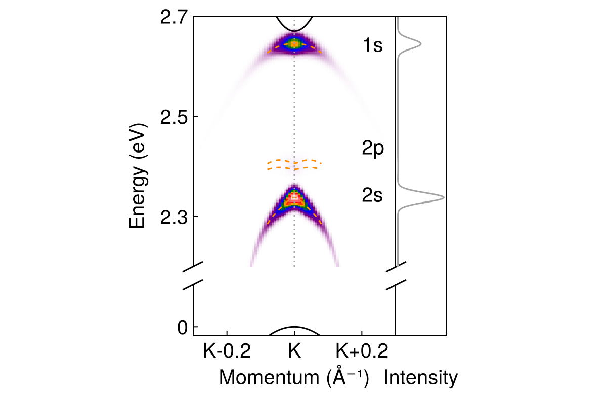
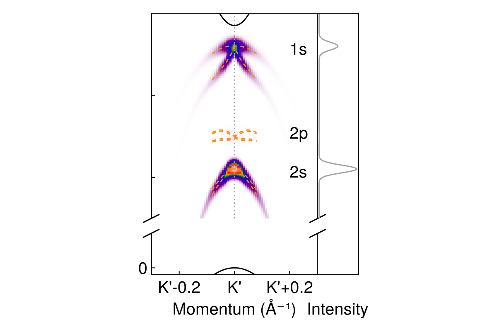
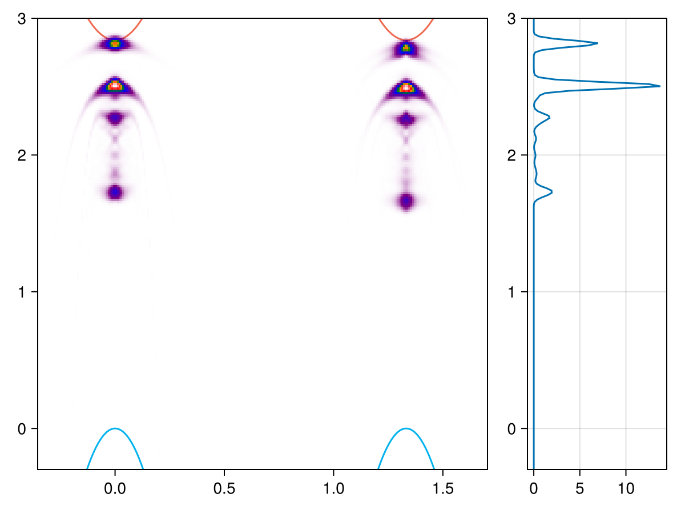
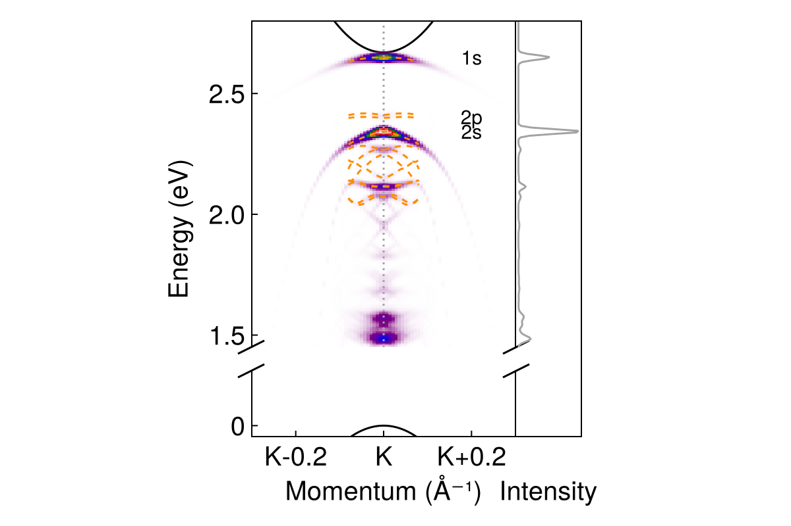
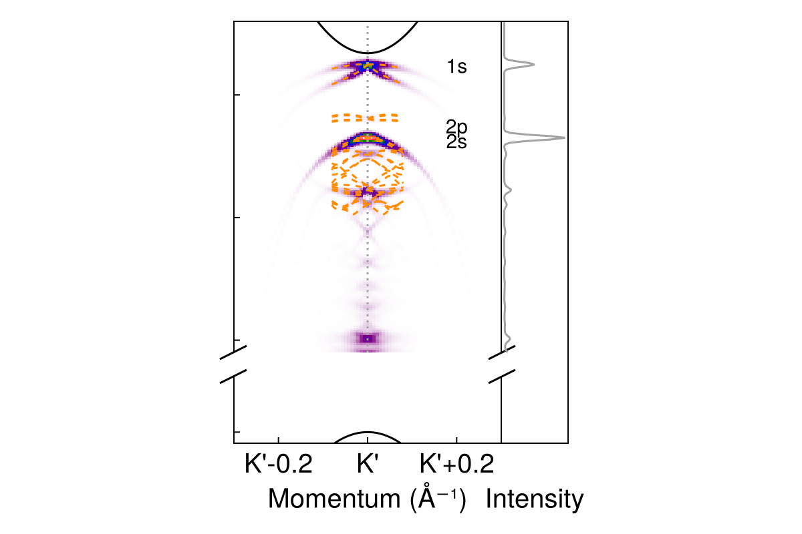

ARPES imaging of eeh trions, with excitons forming in the residue state
===========

Running [`eeh-heatmap-prototype-discrete-final.jl`](eeh-heatmap-prototype-discrete-final.jl),
we get 

To make the figure look more "elaborated", run [`eeh-heatmap-prototype-discrete-final-zoom-in-display.jl`](eeh-heatmap-prototype-discrete-final-zoom-in-display.jl),
and we get 

Or we can try to break the y axis:
run [`eeh-heatmap-prototype-discrete-final-zoom-in-display-fold.jl`](eeh-heatmap-prototype-discrete-final-zoom-in-display-fold.jl), and we get 

Run [`eeh-heatmap-prototype-discrete-final-zoom-in-display-fold-fully-labeled.jl`](eeh-heatmap-prototype-discrete-final-zoom-in-display-fold-fully-labeled.jl) to have a fully labeled version with info like "this is the A series unlike-spin 1s exciton" included into the figure.

We note that the intensity of the 2s peak seems to be higher than that of the 1s peak.
This is not due to visual illusions.
If we plot the exciton wave functions with respect to $\abs{\vb{k}}$,
this is what we get for the 1s state:

and this is what we get for the 2s state:

And it can be observed that the absolute intensity of the negative center of the 2s wave function happens to be higher than that of the positive center of the 1s wave function.
After computing the overlap between the exciton wave functions and the trion wave function,
here is what we get for the 1s state (the third panel is the trion wave function):

and here is what we get for the 2s state (again, the third panel is the trion wave function):

Note that the structure of the trion wave function means that for the 2s state, it is the negative central part that contributes most to the overlap matrix element;
the contribution from the positive part of the 2s exciton wave function being weak 
means that there is almost no cancellation from the influences of the positive and negative parts of the 2s exciton wave function,
which, together with the fact that the central part of the 2s exciton wave function has a higher intensity,
means the overlap between the exciton and the trion wave functions should indeed be higher.

The final images displayed in the paper are generated by [`eeh-heatmap-prototype-discrete-final-zoom-in-display-fold-linecut-K.jl`](eeh-heatmap-prototype-discrete-final-zoom-in-display-fold-linecut-K.jl) and [`eeh-heatmap-prototype-discrete-final-zoom-in-display-fold-linecut-Kp.jl`](eeh-heatmap-prototype-discrete-final-zoom-in-display-fold-linecut-Kp.jl)

These plots only show the first couple exciton bands;
when we include the first 200 bands into the calculation,
by running [`eeh-heatmap-prototype-discrete-final-lots-of-bands.jl`](eeh-heatmap-prototype-discrete-final-lots-of-bands.jl),
we get 

Increasing the number of bands from 200 to 300 only makes the high-energy continuum wider.

Run [`eeh-heatmap-prototype-discrete-final-zoom-in-display-fold-linecut-K-lots-of-bands.jl`](eeh-heatmap-prototype-discrete-final-zoom-in-display-fold-linecut-K-lots-of-bands.jl) and [`eeh-heatmap-prototype-discrete-final-zoom-in-display-fold-linecut-Kp-lots-of-bands.jl`](eeh-heatmap-prototype-discrete-final-zoom-in-display-fold-linecut-Kp-lots-of-bands.jl) to get the following plots:

