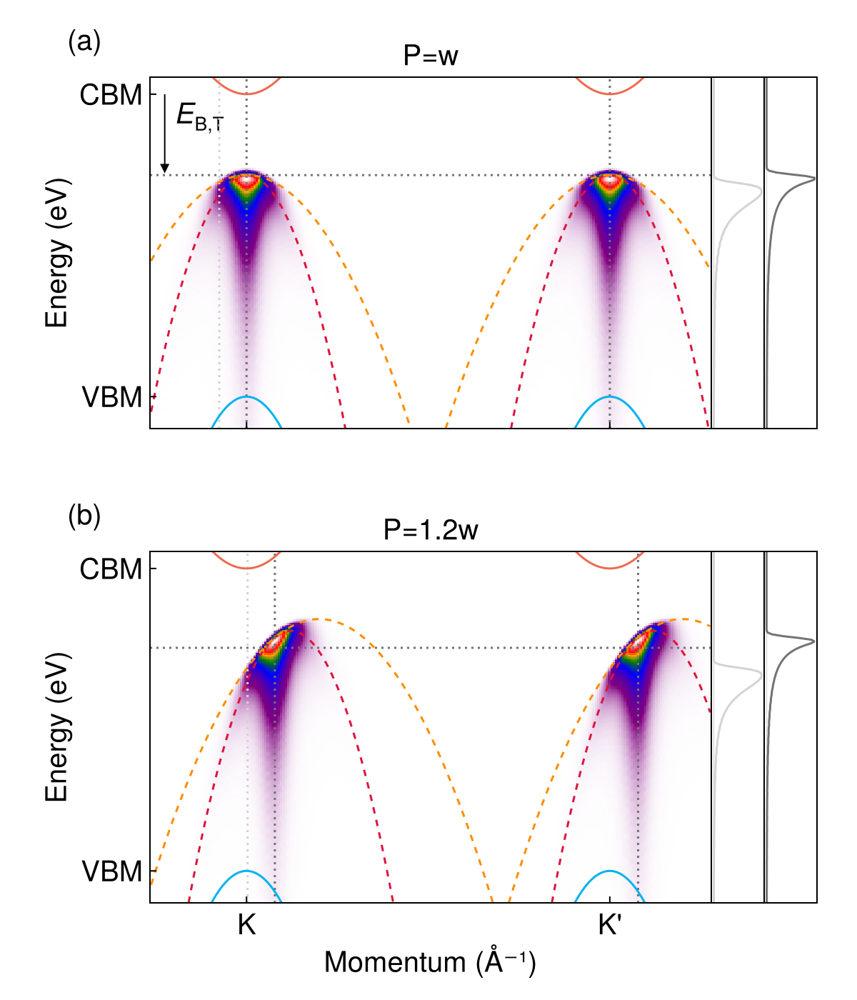
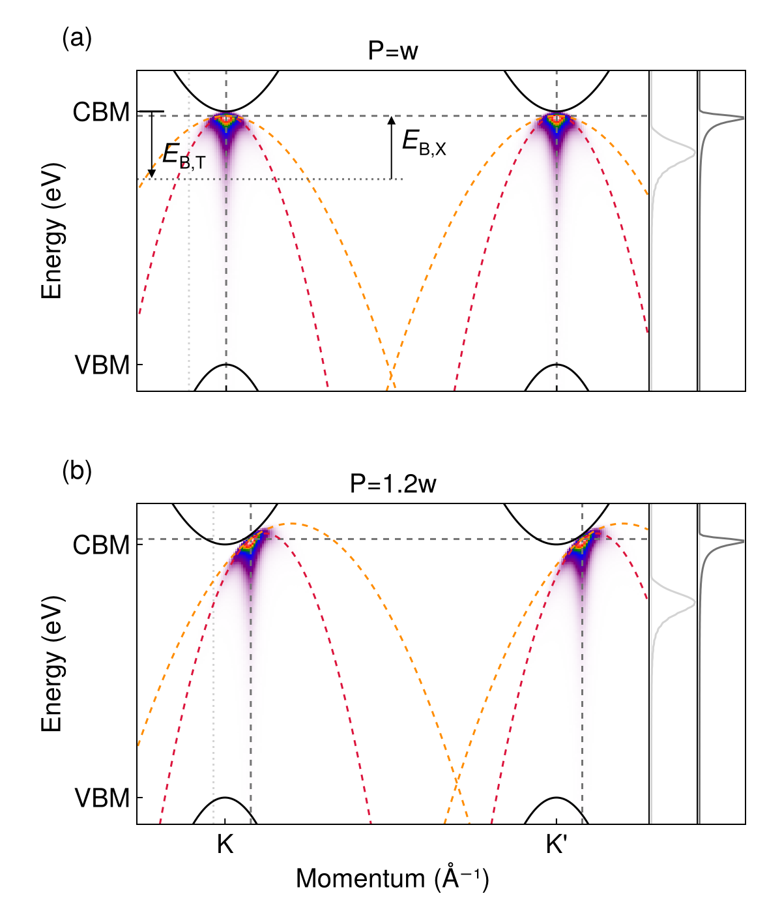

[`eeh-display.jl`](eeh-display.jl) is based on [`eeh-heatmap-prototype.jl`](eeh-heatmap-prototype.jl).
Its output is 

To include linecuts and make everything more compact,
we use [`eeh-display-2.jl`](eeh-display-2.jl)
to generate 

Finally, when the exciton binding energies of the final states are considered,
using [`eeh-display-2-residue-energy.jl`](eeh-display-2-residue-energy.jl), we get 

Note that all images shown here except the last one w
ere generated using the 3D trion wave function
and therefore are strictly speaking incorrect,
although nothing qualitative is wrong.
