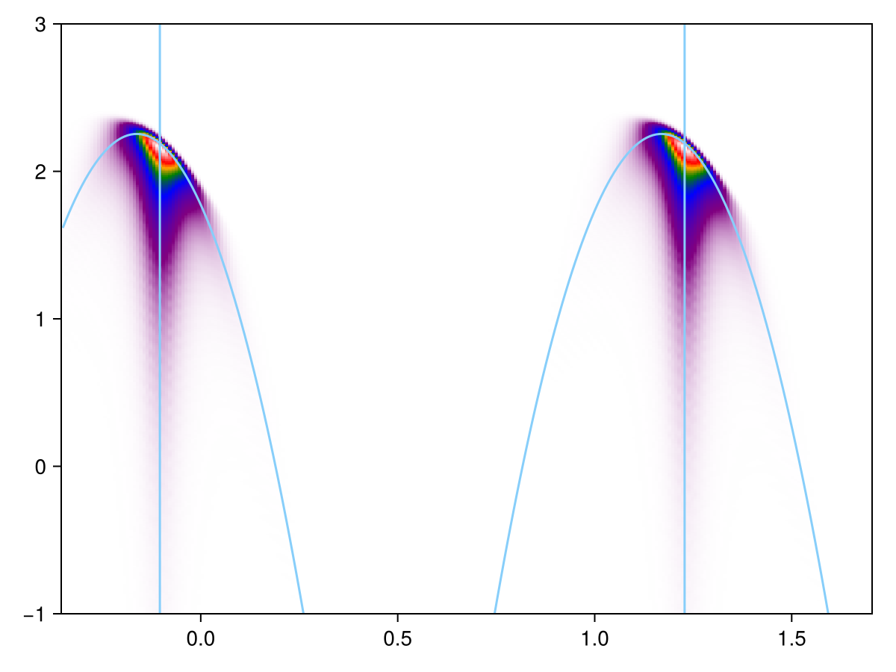

# The contributions of $\vb{k}_{1,2}$'s to the final ARPES heatmap

Running [`eeh-heatmap-prototype.jl`](eeh-heatmap-prototype.jl), we get 

In this figure the trion momentum is $\vb{P} = 0.8 \vb{w}$.
It can be observed that the ARPES signature includes a plurity of dispersion relations,
similar to the [ehh case](ehh-k1-contribution.md).
What makes the eeh and the ehh cases different includes
- The apperance of two signatures, each of which is from a valley, and 
- the apperance of vertical bars.

This figure is also used to [benchmark the output of the new program with the old program](benchmarks.md#comparison-with-old-codes).

# The structure of the contribution of each 