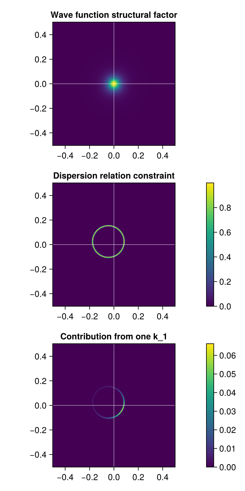
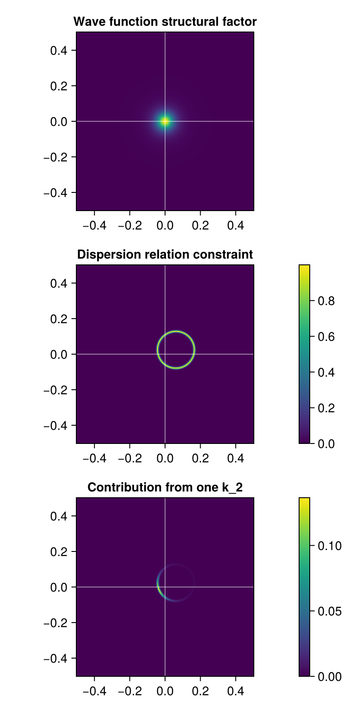
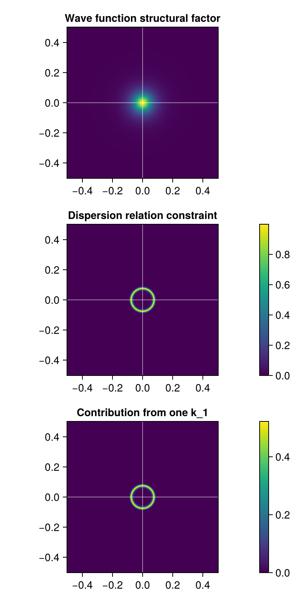

# The contributions of $\vb{k}_{1,2}$'s to the final ARPES heatmap

Running [`eeh-heatmap-prototype.jl`](eeh-heatmap-prototype.jl), we get 

In this figure the trion momentum is $\vb{P} = 0.8 \vb{w}$.
It can be observed that the ARPES signature includes a plurity of dispersion relations,
similar to the [ehh case](ehh-k1-contribution.md).
What makes the eeh and the ehh cases different includes
- The apperance of two signatures, each of which is from a valley, and 
- the apperance of vertical bars.

This figure is also used to [benchmark the output of the new program with the old program](benchmarks.md#comparison-with-old-codes).

# The structure of the contribution of each 

Unlike the [ehh case](ehh-k1-wfn-and-dispersion-prototype.jl),
in the eeh case, both peaks can contribute to the ARPES heatmap.
In the case where we fix $\vb{k}_{\text{e2}}$ and let $\vb{k}_1$ move around is calculated in [`eeh-k1-wfn-and-dispersion-prototype.jl`](eeh-k1-wfn-and-dispersion-prototype.jl), the contribution of a single $\vb{k}_1$ is shown below

On the other hand, the case where we fix $\vb{k}_{\text{e1}}$ and let $\vb{k}_2$ move around is calculated in [`eeh-k2-wfn-and-dispersion-prototype.jl`](eeh-k2-wfn-and-dispersion-prototype.jl), the contribution of a single $\vb{k}_1$ is shown below

Note that in the above paragraph, when we say "contribution from $\vb{k}_2$", what we mean is "the electron from the second valley remains after photoemission happens and therefore contribute to the residue energy"; the electron driven out is from the first peak, not the second.

In the output of [`eeh-k1-wfn-and-dispersion-vertical-stripe-prototype.jl`](eeh-k1-wfn-and-dispersion-vertical-stripe-prototype.jl), which is shown below:

we see that the wave function structural factor appears at the center of the dispersion relation circle, and significant contribution can be seen everywhere on the circle.