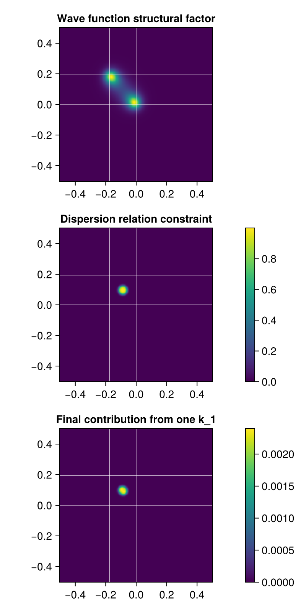
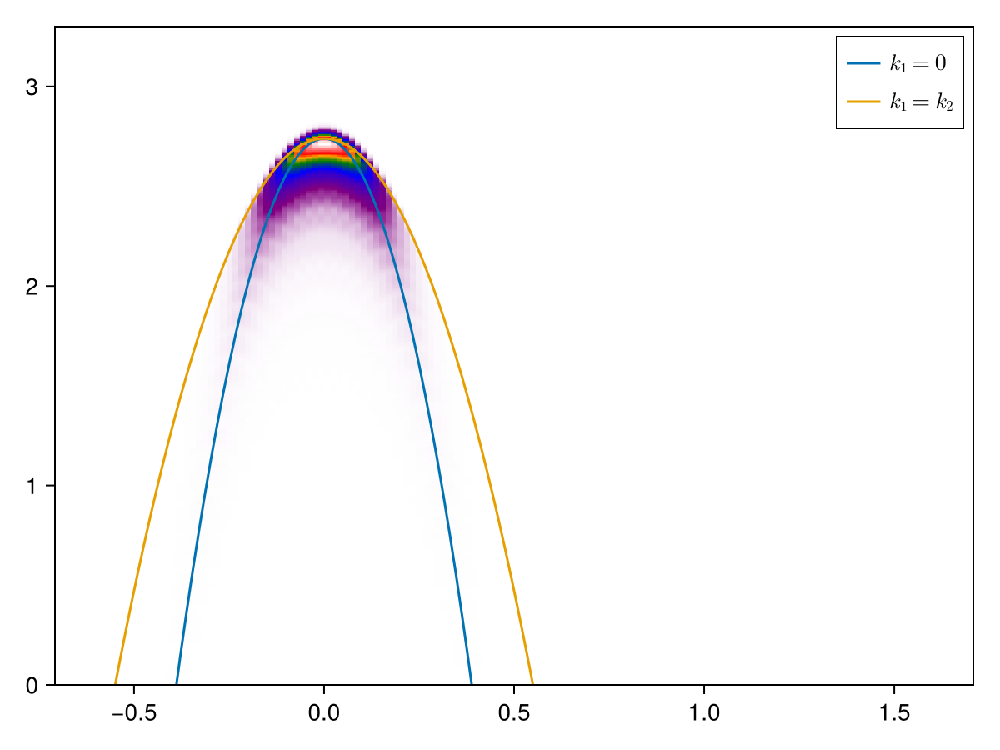

# The contributions of $\vb{k}_1$s to the final ARPES heatmap

Running [`ehh-heatmap-prototype.jl`](ehh-heatmap-prototype.jl), we get 

In this figure the trion momentum is $\vb{P} = 1.2 \vb{w}$.
It can be observed that the ARPES signature includes a plurity of dispersion relations.

This figure is also produced in the rightmost panel in the output of [`ehh-k1-contribution-benchmark.jl`](ehh-k1-contribution-benchmark.jl),
which is to [benchmark the output of the new program with the old program](benchmarks.md#comparison-with-old-codes).

# The structure of the contribution of each $\vb{k}_1$

In the ARPES formula we have a dispersion relation and a wave function structural factor from the trion wave function.
Running [`ehh-k1-wfn-and-dispersion-prototype.jl`](ehh-k1-wfn-and-dispersion-prototype.jl),
we get the following plot:

It can be observed that 
- In the plane of $\vb{k}_1$, the dispersion relation is like a ring,
while the wave function structural factor has two peaks.
- The peaks are close to (but not identical to) where $\vb{k}_1 = 0$ or $\vb{k}_2 = 0$, which are represented by crosses. The reason is when $\vb{k}_1 = 0$, $\vb{k}_2$ is suboptimal w.r.t. the wave function of another momentum degree of freedom.
- The center of the dispersion relation circle is the same as the center of the image of the wave function structural factor. This is a consequence of equivalence of $\vb{k}_{1,2}$.

The image above fixes $\omega$, so that we can have a 2D representation of the dispersion relation.
When we move $\omega$, the dispersion relation circle changes its size (but not position),
and correspondingly the final contribution from one $\vb{k}_1$ changes its strength.
Preferrably, the dispersion relation circle should go close to the peaks of the wave function structural factor.

When $\vb{k}_1 = 0$ or $\vb{k}_2 = 0$, the dispersion relation circle almost passes one of the two peaks in the wave function structural factor (although the true peak is slightly off, because when one $\psi$ is maximized, another isn't).
When $\vb{k}_1 = \vb{k}_2$, there is also one $\omega$ that agrees with the dispersion relation,
and this is actually the maximal $\omega$ allowed.
When the $\omega$ is set to this $\omega$, the dispersion relation circle reduces to a dot,
which lies between the two peaks of the wave function structural factor, which is a saddle point, and therefore still has a significant ARPES intensity.
The image below is from [`ehh-k1-wfn-and-dispersion-k12-equal-prototype.jl`](ehh-k1-wfn-and-dispersion-k12-equal-prototype.jl):

So we expect the $\vb{k}_1 = \vb{k}_2$ dispersion relation to be the upper bound of the ARPES signature, which is indeed seen in the first image in this document.
So basically, we find that the curvatures at the center of the signature and at the upper edge of the signature are quite different.
Here we present the ARPES heatmap of the $\vb{P} = \vb{w}$ case,
which is drawn by [`ehh-heatmap-zero-momentum-prototype.jl`](ehh-heatmap-zero-momentum-prototype.jl),
and is shown here:

It's more clear that the curvatures of the edge and the peak are not the same.