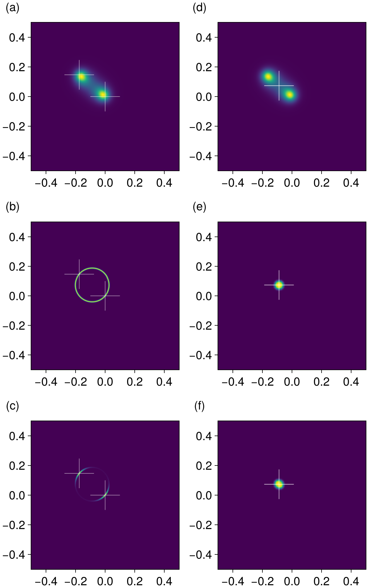

[`ehh-momentum-conservation-factor.jl`](ehh-momentum-conservation-factor.jl) is based on [`ehh-heatmap-prototype.jl`](ehh-k1-contribution.md#the-structure-of-the-contribution-of-each).
The output is 

We can also do it in a more compact way using [`ehh-momentum-conservation-factor-compact.jl`](ehh-momentum-conservation-factor-compact.jl):

