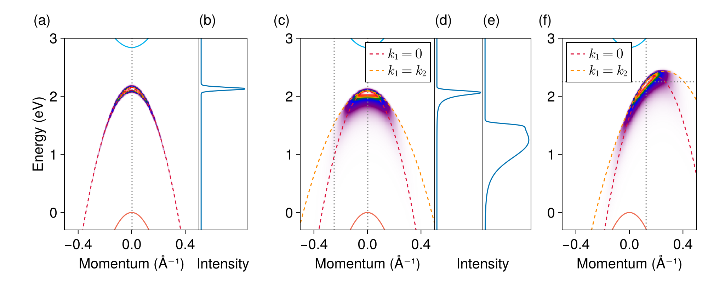

[`ehh-no-momentum-display.jl`](ehh-no-momentum-display.jl) is based on [`ehh-heatmap-prototype.jl`](ehh-k1-contribution.md#the-contributions-of-s-to-the-final-arpes-heatmap).
The output is 

Note that the vertical gray dotted lines correspond to the momentum of the intensity plots (b, d, e).

We can also plot the panels in a more compact form.
This is done by [`ehh-no-momentum-display-compact.jl`](ehh-no-momentum-display-compact.jl).
The result is shown below:

Here we also include [`ehh-shifted-momentum-display.md`](ehh-shifted-momentum-display.md).