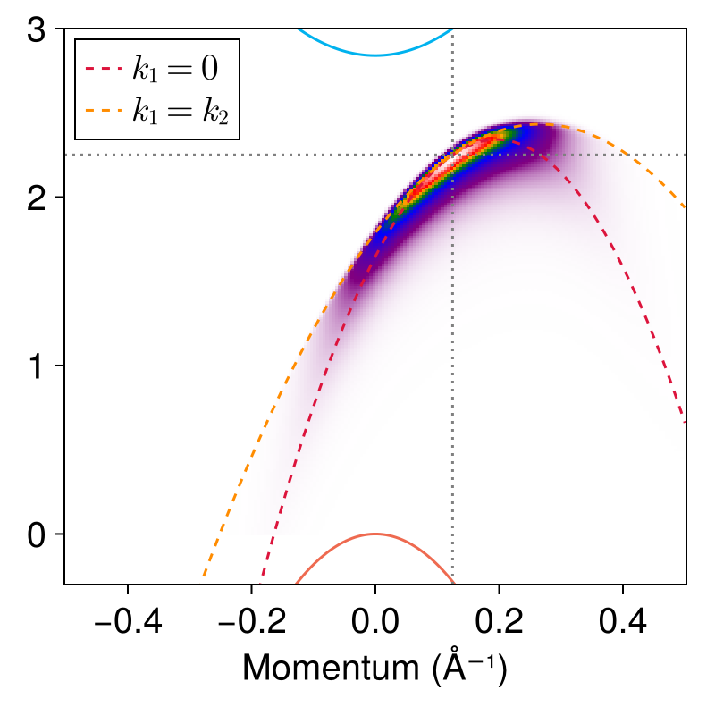

The code [`ehh-shifted-momentum-display.jl`](ehh-shifted-momentum-display.jl)
is based on [`ehh-heatmap-prototype.jl`](ehh-k1-contribution.md#the-structure-of-the-contribution-of-each),
and its output is 

