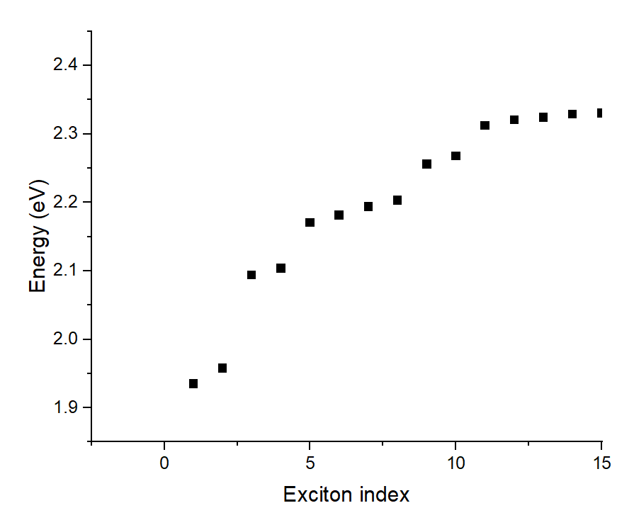
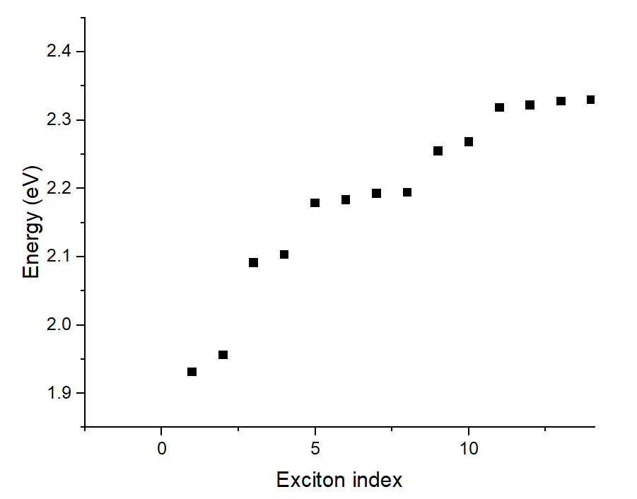
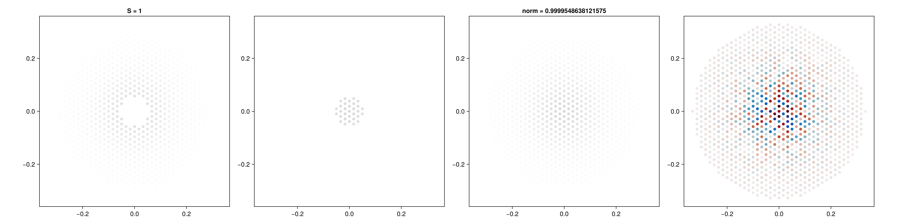
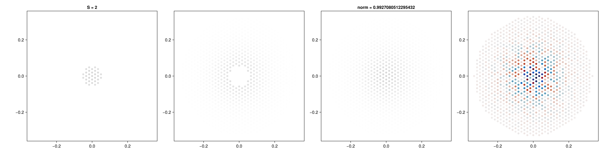
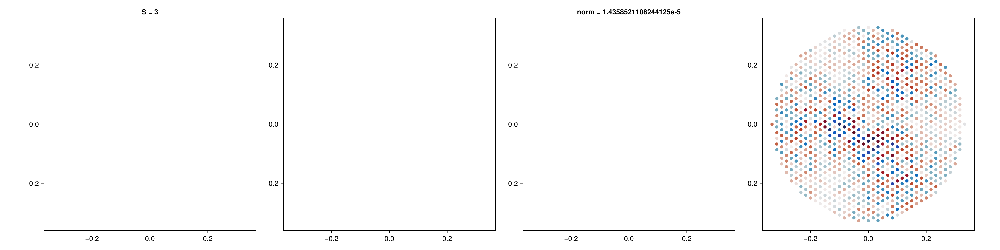
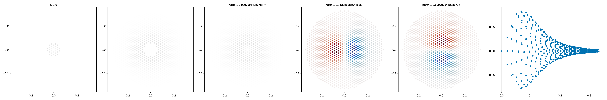
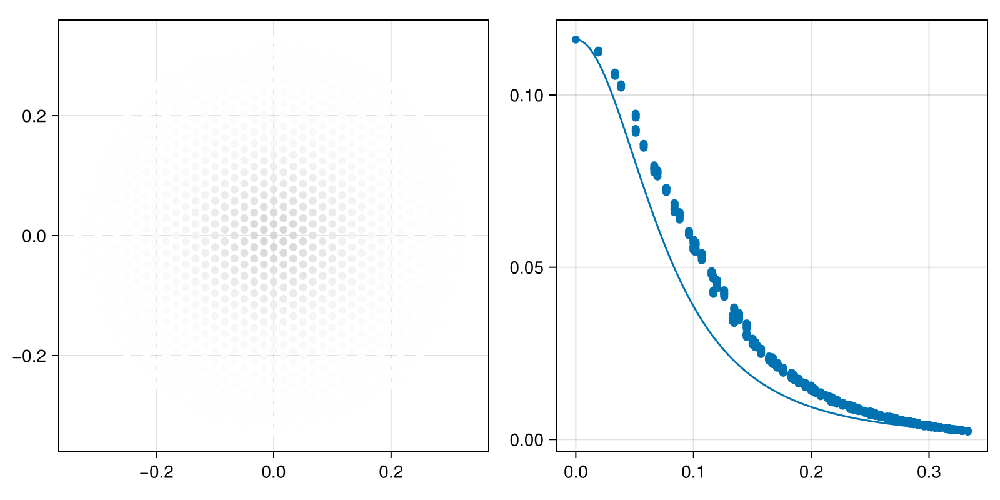

Running [`exciton-patch-0.jl`](exciton-patch-0.jl) and [`exciton-patch-0.jl`](exciton-patch-0.jl),
we get all the `exciton-*.png` files.
What we want to do is to pair these wave functions to exciton bands in https://arxiv.org/pdf/1507.03336.

This is related to several non-trivial facts related to the excitonic structure of TMD materials.

1. There are A and B series excitons. 
   The hole constituent of A is from the upper valence band,
   and the hole constituent of B is from the lower valence band.
2. The band structure of the conduction bands can be found in Fig. 1 of the paper. 
   Note that the spin of the highest valence band is parallel to the spin of a dip 
   (the central part of the lowest band)
   but opposite to the spin of the rest of the lowest band.
   The most natural definition of the "spin-up" band 
   (if we assume that the highest valence band in the valley we're interested in is spin-up)
   therefore is patched.
3. There are like-spin and unlike-spin states; 
   note that the permissible K-K end state is like-spin,
   while the permissible K-K' end state is unlike-spin.
4. There is K/K' degeneracy when Q=0, and because of the long-range exchange term,
   when Q goes to non-zero values, we observe splits.
   This is how we get the parabolic/linear split near Q=0.
   Note that we only care about excitons at K in this work.
5. In the Q=0 patched calculation I have, we only have K-K transitions.
   In calculating transition matrix elements between the trion and the excitonic residue state,
   only the K-K component of the hybridized exciton wave functions matters.
   Therefore if state 1 and state 2 are from the degenerate K-K and K'-K' states 
   separated by the long-range exchange term,
   then the "exciton wave function" used in calculating the transition matrix elements 
   for both states should be the identical K-K exciton state.

Fig. 2 of the paper contains all exciton states relevant in trion ARPES calculation.
For both K-K and K-K' transitions,
we have 2 1s and 2s states (in the Q=0 plot, there are actually four states,
but that's due to K-K and K'-K' degeneracy),
one like-spin, one unlike-spin,
and 4 2p states, two like-spin, two unlike-spin.
The question is how we can match them with the eigenvectors obtained after diagonalizing the BSE matrix for patched K-K and K-K' calculations.

Fig. 1 of the supplementary material illustrates the full exciton series.
In our patched Q=0 calculation, K'-K' transitions are absent,
and therefore we should ignore the double degeneracy at Q=0 due to the K/K' degeneracy.
On the other hand, B excitons are *in* our calculations.
By staring at Fig. 1, we find that in our calculations, we should expect to see 
1. 2 1s A excitons, one dark (meaning that it's an unlike-spin exciton; we adopt this definition of dark/bright distinction even for Q=K excitons), one bright (meaning that it's an like-spin exciton),
2. 2 1s B excitons, again one dark and one bright, but this time the hole is on the second highest valence band, and not the highest valence band.
3. Four 2p A excitons, two dark, two bright,
4. 2 2s A excitons, one dark, one bright.

The first 10 exciton modes, both in the Q=0 and Q=K calculations, should follow the patter above.

This can be confirmed by plotting the exciton energy series in [the Q=0 calculation](../../MoS2/MoS2/4-absorption-120-no-sym-gw/eigenvalues.dat)
and [the Q=K calculation](../../MoS2/MoS2/4-absorption-120-no-sym-gw-K/eigenvalues.dat):
the energy spectrum of the first calculation is 

while the energy spectrum of the second calculation is

We can clearly see the 2-2-4-2 structure in both calculations.

We can also inspect the exciton wave function image files to confirm that the excitons are what we expect them to be.
In [`exciton-patch-0.jl`](exciton-patch-0.jl) and [`exciton-patch-K.jl`](exciton-patch-K.jl),
we only plot the $v = 1, c = 1$ (the first panel) and $v = 1, c = 2$ (the second panel) exciton wave function amplitudes.
Because of the like-spin/unlike-spin structure of the exciton spectrum,
and the aforementioned pattern in the band structure,
we expect to see patches and holes in these two panels.
Adding them together, we get the full wave function amplitudes
for like-spin or unlike-spin excitons.

Before doing so, be reminded that because of the random phase factors included into the single electron wave functions in DFT,
the $A_{vc\vb{k}}$ values also have random phase factors.
Here we assume that the lowest 1s states are "real",
i.e. in them, no phase difference exists between different $\vb{k}$ points
if we require the phase difference between single-electron wave functions at different $\vb{k}$ points to be small enough,
and extract the phase factors by calculating $A^{1s}_{vc\vb{k}} / \abs{A^{1s}_{vc\vb{k}}}$.
This is demonstrate in [this script](phase.jl).

In the Q=0 calculation,
below is an illustration of the structure of an unlike-spin A exciton:

Note that the intensity of the $v = 1, c = 1$ transition is absent near the K valley,
meaning that the electron constituent has a spin opposite to that of the valence band.
The random gauge factor in this wave function is *not* eliminated,
because the $A^{1s}$ exciton used above is the like-spin exciton, and not the unlike-spin exciton.

Below is an illustration of the structure of a like-spin A exciton:

The strength of the $v = 1, c = 1$ transition is concentrated near the K valley,
meaning that the electron constituent has a spin parallel to that of the valence band.

Below is an illustration of the structure of a B exciton:

Below is an illustration of the structure of a A2p exciton:

We also compare the first-principles 1s exciton wave function with the hydrogen atom solution.
For the exciton radius, see [here](constants.md).
Running [`exciton-radius.jl`](exciton-radius.jl), we get 

