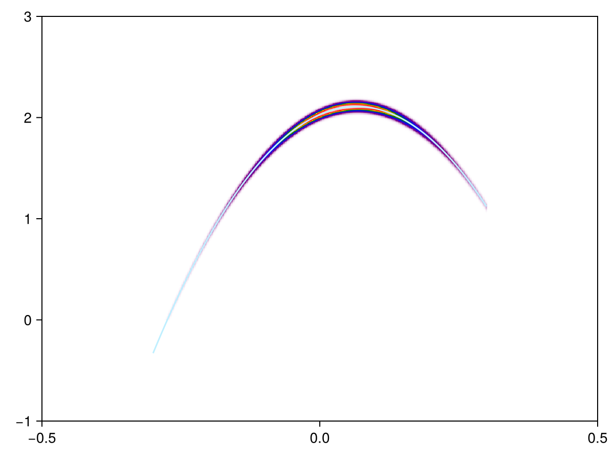
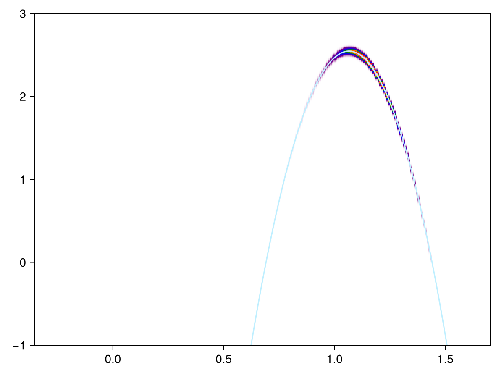

In [`eh-direct-heatmap-prototype.jl`](eh-direct-heatmap-prototype.jl)
and [`eh-K-Kp-heatmap-prototype.jl`](eh-K-Kp-heatmap-prototype.jl),
we calculate the ARPES signatures of exciton modes in the direct optical band gap 
and in the K-K' band gap.
The images are shown below:

and

