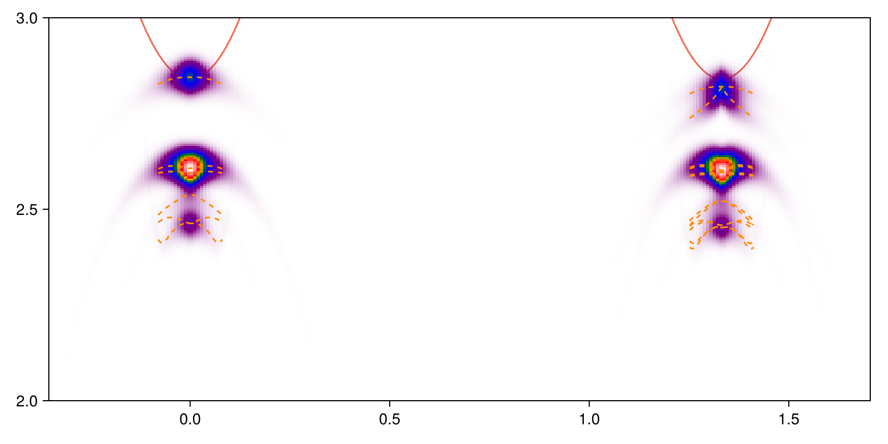

ARPES spectrum of trion, with discrete excitonic final states
===========

# With a single exciton state 

Run [`eeh-heatmap-prototype-discrete-final-single-exciton.jl`](eeh-heatmap-prototype-discrete-final-single-exciton.jl),
and we get the follows:


Note that the momentum spread of the signature is narrower than the [exciton ARPES heatmap](ehh-no-momentum-display.md),
although the dispersion relations of the both heatmaps are identical to the exciton band.
The reason is the different overlap matrix elements:
in the heatmap presented above, we are calculating the overlap between the two blurry blobs,
while in the exciton ARPES calculation, we calculate the overlap between a blurry blob and a delta function.
If the [trion wave function](wfn.jl) is turned to the old `(1 + k^2 a^2 / 4)^2`,
the momentum spread of the signature looks much closer to the exciton ARPES heatmap.
That the momentum spread of the signature is much narrower means if we want the exciton band to be seen clearly, then the energy broadening should be reduced.

Note the function invocation takes the following form:
```julia
Akω_total = trion_ARPES_eeh(trion, P, Ak1k2, IntraValley2DExciton, [exciton_direct], [Avck_A1s_bright], [rk], k1_list, ω_list, broaden)
```
Here we have a caveat related to the language features of Julia.
The array `[exciton_direct]` can be enriched by other types of excitons,
and they make up an array of things with a shared abstract type only.
This in turn means we have to pass the shared type (here it's a concrete type `IntraValley2DExciton`, but it can be an abstract type) to the function.

To make sure the exciton wave function is read properly,
we also draw what we read from the exciton eigenvectors file:


# The linear-parabolic splitting

Run [`exciton-band-gamma-Qiu-data.jl`](exciton-band-gamma-Qiu-data.jl),
we get 


This means the solver works as expected.

# With the lowest exciton modes 

Run [`eeh-heatmap-prototype-discrete-final.jl`](eeh-heatmap-prototype-discrete-final.jl), and we get 


The reason why we have different ARPES signatures at the two different valleys
is that when the electron at the K valley is excited,
the residue state is an exciton with momentum K,
meaning that the parabolic-linear splitting is absent;
on the other hand, when the electron at the K' valley is excited,
the residue state is a exciton near Γ point,
and the parabolic-linear exciton band structure appears in the ARPES signature.
Note that as is discussed above,
the momentum spread of the signature is low,
and if we want to display the exciton bands clearly,
the energy broadening needs to be reduced.
The result is exemplified above.

We zoom in. Running [`eeh-heatmap-prototype-discrete-final-zoom-in.jl`](eeh-heatmap-prototype-discrete-final-zoom-in.jl), we get



